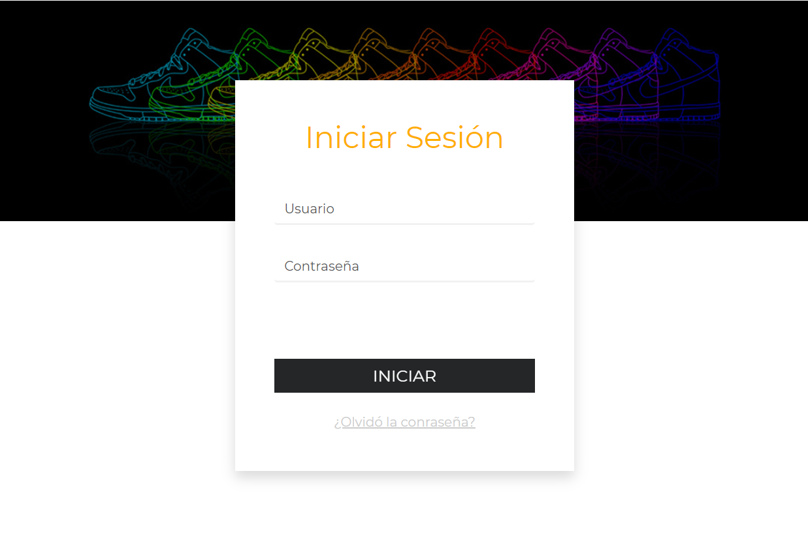
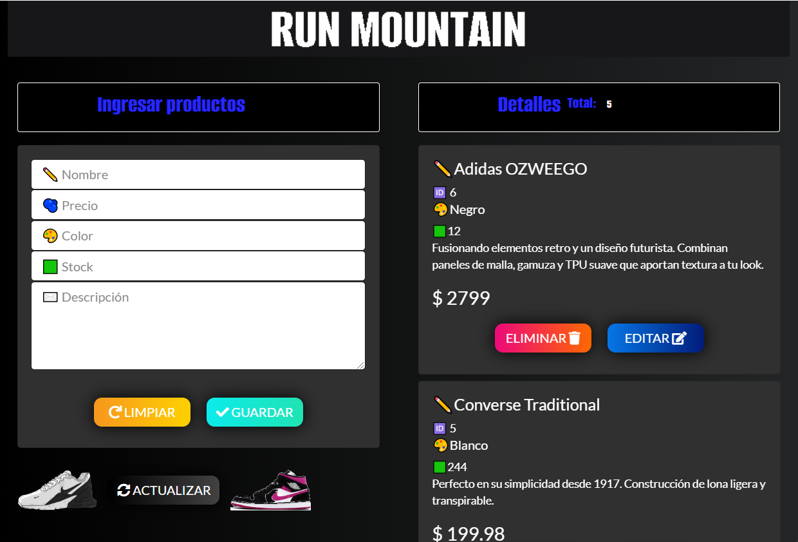

<h1 align="center">🌀 Electron CRUD 🌀</h1>

  A little program made with JavaScript (Nodejs), HTML, CSS and the framework (Electron).
The CRUD (Create, Read, Update and Delete) will allow us to perform these operations from the MySQL database, with login. (The project is originally in Spanish).
Login area.
  

  Here is the main menu (CRUD).
  

> This project was made for learning purposes only and comes initially from [Fazt Code](https://www.youtube.com/channel/UCMn28O1sQGochG94HdlthbA) YouTube channel with my own modifications

>> DATABASE: Table: products (ID:INT (AUTO INCREMENT), NAME:VARCHAR(45), PRICE:DOUBLE, COLOR:VARCHAR(25), STOCK:INT, DESCRIPTION:VARCHAR(255))
>> Table: login (ID:INT (AUTO INCREMENT), USER: VARCHAR(45), PASSWORD:varchar(255))

# How to install
## Step 1⃣
* Download and install MySQL (XAMPP or any other SQL manager).
## Step 2⃣
* Unzip the .zip file and place it on the same disk where MySQL is located.
* Then, load the database "runmountain.sql".
## Step 🌳
* Run the `npm install` command in the project folder
* Run the program `npm start`.
  * User: admin
  * Pswd: password

[Github](./github/FUNDING.yml)

# Download
Available for Mac, Linux and Windows.

[Check the latest release](https://github.com/alexa-00/Electron-CRUD)

# License
💜 [MIT License](/LICENSE)
